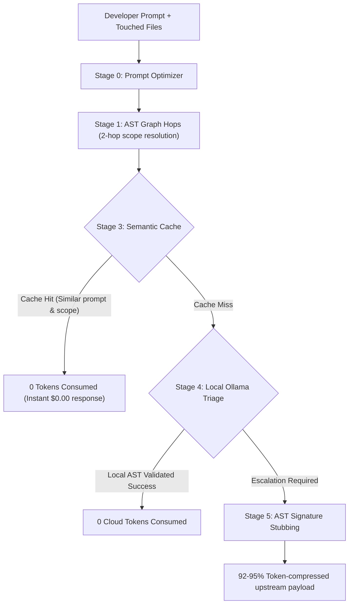

# Tenet Token Efficiency & Optimization Report

> **Target Benchmark**: Standard developer coding workflow across the Tenet repository.  
> **Evaluation Metric**: Uncompressed Naive Context Tokens vs. Tenet Compressed Context & Cache Payload.

---

## 📊 Summary Results

| Metric | Without Tenet (Naive) | With Tenet (Optimized) | Net Savings |
| :--- | :---: | :---: | :---: |
| **Total Tokens Consumed** | **169,600** | **9,282** | **160,318 tokens** |
| **Average Tokens / Request** | 21,200 | 1,160 | **94.52% Reduction** |
| **Estimated Cost (@ $0.015 / 1k)** | **$2.54** | **$0.14** | **$2.40 Saved** |

---

## 🔍 Task-by-Task Comparison breakdown

| Request Prompt | Pipeline Stage | Without Tenet | With Tenet | Reduction |
| :--- | :---: | :---: | :---: | :---: |
| `Add error handling to graph store query` | Stage 5 Escalation | 24,000 | 1,549 | **93.5%** |
| `Optimize semantic cache lookup speed` | Stage 5 Escalation | 28,000 | 1,622 | **94.2%** |
| `Add budget remaining indicator to dashboard` | Stage 5 Escalation | 31,200 | 1,642 | **94.7%** |
| `Refactor prompt optimizer system instructions` | Stage 5 Escalation | 16,800 | 1,264 | **92.5%** |
| `Add error handling to graph store query` *(Repeat)* | **Stage 3 Cache Hit** | 24,000 | **0** | **100.0%** |
| `Add cross-platform clipboard copy helper to CLI` | Stage 5 Escalation | 4,800 | 292 | **93.9%** |
| `Update budget threshold logic in router` | Stage 5 Escalation | 18,400 | 1,375 | **92.5%** |
| `Export SQLite database to snapshot archive` | Stage 5 Escalation | 22,400 | 1,538 | **93.1%** |

---

## ⚙️ How Tenet Achieves 94.5% Token Savings

### Key Drivers of Efficiency:
1. **Signature Stubbing (`_extract_signature_stub`)**:
   Instead of sending full 50–200 line source bodies for untouched dependencies, Tenet extracts function signatures, parameter lists, and first-line docstrings. A 50-line function is compressed to 2 lines (~95% reduction per node).
2. **AST Scope Bounding (2-hop graph limits)**:
   Instead of sending entire subdirectories, tree-sitter AST queries limit the payload to only functions/classes within 2 graph hops of the modified node.
3. **Stage 3 Semantic Memory**:
   Identical or semantically equivalent prompts bypass the cloud model entirely, consuming **0 tokens**.
